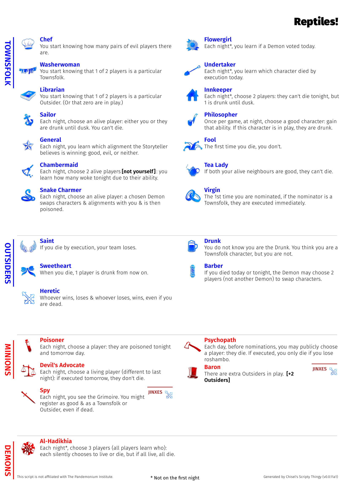
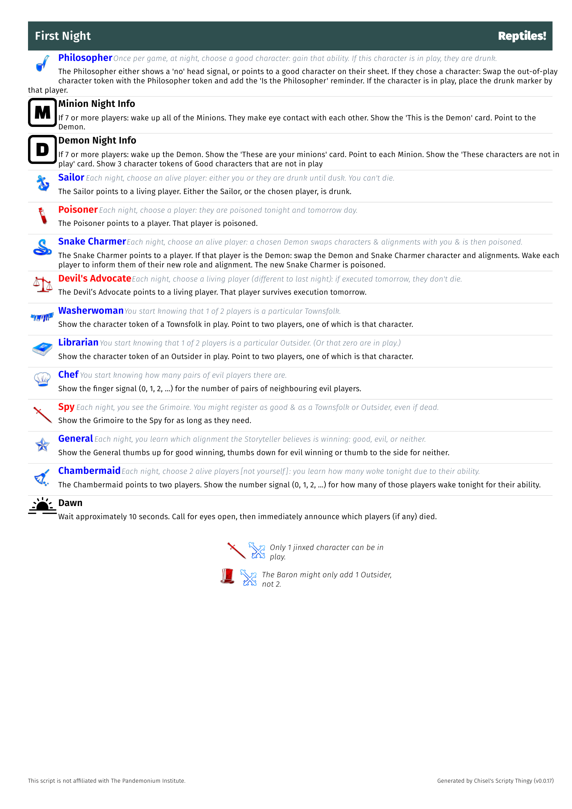
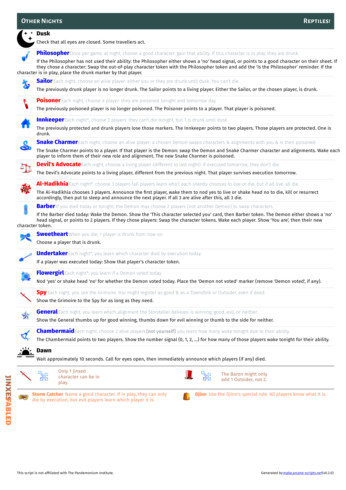

# json2pdf for Blood on The Clocktower

<!-- markdownlint-disable MD013 -->

   

<!-- markdownlint-enable MD013 -->

Yet Another Custom Script Generator for [Blood on the Clocktower][botc]

With apologies to those in Weird Paper Size Land&trade;, this project currently
creates A4 size PDFs. I haven't tried viewing, printing or scaling to _Letter_.
If there's huge demand I may look into this later.

## Requirements

- `python` 3.11, or newer
- `poetry`
- `make` is strongly recommended, but you can skip it if you know what your doing

## Usage

No Scripts Are Stored In This Project Overnight

To get some scripts to test/work with:

```sh
make grab-some-scripts
```

If you're feeling bold, you can grab and render in one:

```sh
make grab-some-scripts all-scripts
```

### Sanity Check

The easiest way to get started is to generate a copy of the Trouble Brewing script:

```sh
make tb
```

Generated files are saved in the [`pdfs/`](pdfs/) directory.

### Single Script

To generate a PDF for a custom script, download the JSON, and use `make
process`. For example:

```sh
make process INPUT_FILE="scripts/No Roles Barred.json"
```

### All Scripts

To generate PDF files for all files in the [`scripts`](scripts/) directory you
can use:

```sh
make all-scripts
```

### Sample Output

<!-- markdownlint-disable MD013 MD026 MD033-->

These have been rendered with this project, and then the PDF was exported to the image files here.
These are just meant to be samples for easy viewing. For best results _generate a PDF_.

#### Trouble Brewing

[This script](https://botc-scripts.azurewebsites.net/script/133/1.0.0)
shows how the official "starter" script looks.

<details><summary>Trouble Brewing - Player Sheet</summary>
<a href="generated/Trouble Brewing/Trouble Brewing-p1.png"></a>
</details>

<details><summary>Trouble Brewing - First Night</summary>
<a href="generated/Trouble Brewing/Trouble Brewing-p2.png"></a>
</details>

<details><summary>Trouble Brewing - Other Nights</summary>
<a href="generated/Trouble Brewing/Trouble Brewing-p3.png"></a>
</details>

#### No Roles Barred

[This script](https://botc-scripts.azurewebsites.net/script/258/1.0.1)
was the script that made me aspire to better custom generated scripts.

<details><summary>No Roles Barred - Player Sheet</summary>
<a href="generated/No Roles Barred/No Roles Barred-p1.png"></a>
</details>

<details><summary>No Roles Barred - First Night</summary>
<a href="generated/No Roles Barred/No Roles Barred-p2.png"></a>
</details>

<details><summary>No Roles Barred - Other Nights</summary>
<a href="generated/No Roles Barred/No Roles Barred-p3.png"></a>
</details>

#### Let's Test Some Jinxes

[This script](scripts/Let's Test Some Jinxes.json)
script was generated purely to have something to test our output with
jinxes in a script. There are probably more than you'd really want, or have, in
a legit custom script so don't panic if it's slightly weird in places...

<details open><summary>Let's Test Some Jinxes - Player Sheet</summary>
<a href="generated/Let's Test Some Jinxes/Let's Test Some Jinxes-p1.png"></a>
</details>

<details><summary>Let's Test Some Jinxes - First Night</summary>
<a href="generated/Let's Test Some Jinxes/Let's Test Some Jinxes-p2.png"></a>
</details>

<details><summary>Let's Test Some Jinxes - Other Nights</summary>
<a href="generated/Let's Test Some Jinxes/Let's Test Some Jinxes-p3.png"></a>
</details>

#### Reptiles!

[This script](https://botc-scripts.azurewebsites.net/script/140/1.4.1)
is a custom script that I've played, and it turns out this is a good test
of "cramming things into one page" and using Top Sekrit data from the generated
script.

<details><summary>Reptiles! - Player Sheet</summary>
<a href="generated/Reptiles!/Reptiles!-p1.png"></a>
</details>

<details><summary>Reptiles! - First Night</summary>
<a href="generated/Reptiles!/Reptiles!-p2.png"></a>
</details>

<details><summary>Reptiles! - Other Nights</summary>
<a href="generated/Reptiles!/Reptiles!-p3.png"></a>
</details>

<!-- markdownlint-enable MD013 MD033-->

## Acknowledgements

Clearly I wouldn't be doing any of this without the existence of
[Blood on the Clocktower][botc], or the existence of [custom scripts][botc-scripts].

I always aspire to take something and make it better (for some value of better)
so after seeing the functional PDFs generated from the [script
tool][botc-scripts] and later the beauty of the [No Roles Barred][script-nrb] I
went on a personal quest to try to generate "beautiful" PDFs from the tool's
JSON.

I stumbled across [LectronPusher's generator][botc-generator] and thought, "I
could tweak this, and be done". I soon realised that life is too short to learn
[LaTeX][latex] and after a pause to ruminate I decided to pull the best parts
together and sprinkle some Chisel-magic into the mix.

For better or worse, this project is the result of that desire.

## Desires

- be able to generate something closely resembling the
  [No Roles Barred][script-nrb] style
- be reasonably simple to edit/restyle
- use existing resources for information (`*.json` from other tools)

## Attribution

- `roles.json` and game icons
  - [LectronPusher/botc-custom-script-generator][botc-generator]
  - … which were originally from [bra1n's townsquare](https://github.com/bra1n/townsquare)
- other icons
  - [Night](https://uxwing.com/night-icon/)
  - [Sunrise](https://uxwing.com/sunrise-icon/)
  - [(D)emon](https://uxwing.com/d-alphabet-icon/)
  - [(M)inion](https://uxwing.com/m-alphabet-icon/)
- [Fira Sans font family](https://www.1001fonts.com/fira-sans-font.html)

<!-- markdown links -->

[botc]: https://bloodontheclocktower.com/
[botc-scripts]: https://script.bloodontheclocktower.com/
[botc-generator]: https://github.com/LectronPusher/botc-custom-script-generator
[latex]: https://www.latex-project.org/
[script-nrb]: https://botc-scripts.azurewebsites.net/script/258/1.0.1
